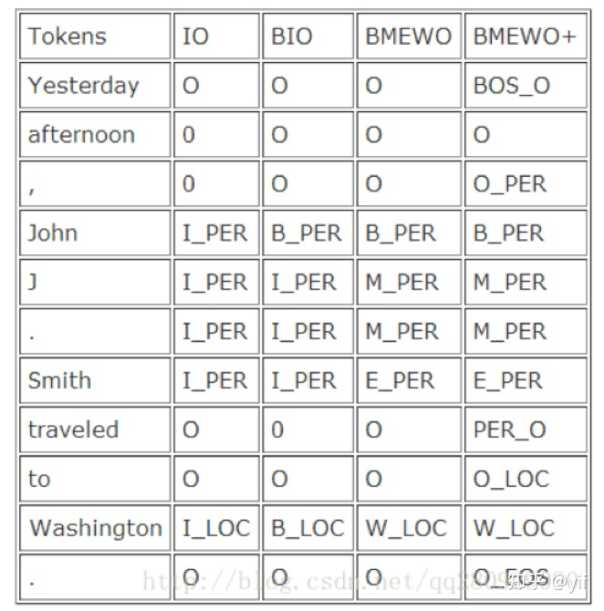

# ABSA平台开发日志

## 2020.09.21

- 讨论平台的整体设计思路，确定了基本功能和创新点
- 为了防止功亏一篑，搞定git，youtube git开发流程, 基本熟悉了分支流程，分支合并，但是多人协作还是不太清楚
- 在dev上创建新分支，开发新功能，然后merge到dev上，删除掉该分支，测试没问题后，在发布到master上
- 拿到学长论文
- 梳理项目

## 2020.09.22

进行了git项目实战， feature->dev->master, 整理项目内容
阅读学长论文，解读模型架构
收集semeval数据

## 2020.09.23

进行xml数据预处理
研究学长代码，整理简化框架，适应新版本
解决包与包之间路径混乱问题
添加进度条，增加训练过程可读性，from tqdm import tqdm

突破口：NER

常用NER标注体系：共有4种标注体系，最常用的还是BIO。BIO标注：将每个元素标注为“B-X”、“I-X”或者“O”。其中，“B-X”表示此元素所在的片段属于X类型并且此元素在此片段的开头，“I-X”表示此元素所在的片段属于X类型并且此元素在此片段的中间位置，“O”表示不属于任何类型。



```python
# model tensor loss_fun
设置bert模型缓存位置代码 from_pretrain('name', cache_dir='path_to_svae)
指定设备 device = torch.device('cuda' if torch.cuda.is_available() else 'cpu')
model = model.cuda()
tensor = tensor.cuda()
model = model.to(device)
tensor = tensor.to(device)
loss = nn.CrossEntropyLoss().to(device)
```

### 存在问题

- 无法自动切换cup，gpu训练
- 代码冗余，太多实验代码，不够纯净
- 缺少良好的用户命令行接口 docopt argparse

## 2020.09.24

tokenize:仅用来分词，不进行2idx的操作， bert的分词自动识别标点，不用考虑是否有空格
首先进行tagset的标记，利用tag的idx标记tokens，然后padding
{'POS': 0, 'NEU': 1, 'NEG': 2}

- feature [CLS] + bert token id + [SEP] (idx, input_ids, input_mask, segment_ids)
- TS target start [0,0,0,0,....1,....0]
- TE target end [0,0,0,0,....1,....0]
- TP target polarity [-1, -1, -1,... (0,1,2), ....-1, -1]
- TN target number 一句话里可能由多个target
- OS opinion start
- OE opinion end
- OP opinion polarity
- ON opinion number 一个target可能有多个opinion
- TOS 128x128 整合TS到一个矩阵中
- TOE 128x128
- TON 128

```python
 def forward(self, input_ids, attention_mask, token_type_ids,
                start_positions_target, end_positions_target, polarity_target, n_target,
                start_positions_opinion, end_positions_opinion, polarity_opinion, n_opinion,
                start_positions_target_opinion, end_positions_target_opinion, n_target_opinion):
```

数据的数值化处理已经解读完毕，开始模型解读

## 总目标

1. 解读学习学长代码结构，摸索代码规范

2. 熟悉git

3. 寻找论文 bo pang liu bing，实现baseline

4. 实现semeval的经典代码

5. 完善包的结构

6. 参考网站<http://xiaosi.trs.cn/demo/rs/demo>

7. 模型的发布和线上加载，借助transoformers平台

8. spanBert

9. 常用关键词抽取方法

10. 搞清楚bert详细的输入输出结构


- 假如要做一个demo，其特色：

    输出：和semeval的输出格式相同

    输入：类型1： 训练集（semeval标注语料）

    ​      类型2：无监督或者半监督的语料。

    0、故事：包括semeval提供的例子。但拿其做个靶子（有标注的、特定领域的），我们能否做一个无标注的、或者少量标注的、开放域的（或者迁移性较好的）

    1、开源系统；github，pip install；

    2、平台。包括该方向的经典算法：如 1, 受 liu bing; pang bo早期的经典算法的启发实现无监督的方法；2、cnn、rnn、svm等（建议参考semeval历届评测的code）

    3、核心创新点： 未来的创新点也许就在： 无监督或者半监督方法（迁移或者开放域的考虑）与预训练模型如bert等的结合上。清华大学刘知远（深度学习时代用hownet搞事情，记得是acl）

    4 可视化（验证如何使用）。自己开发一个web界面，调用自己的平台实现一种应用。一是基本功能的可视化（参见semeval的标准，和它兼容）；二是具体各种应用的可视化（例如舆情应用）。

    无监督或者半监督，腾讯游戏语料。

    目标：顶会的demo、学术影响力、

```python
    <sentence id="813">

    ​     <text>All the appetizers and salads were fabulous, the steak was mouth watering and the pasta was delicious!!!</text>

    ​     <aspectTerms>

    ​          <aspectTerm term="appetizers" polarity="positive" from="8" to="18"/>

    ​          <aspectTerm term="salads" polarity="positive" from="23" to="29"/>

    ​          <aspectTerm term="steak" polarity="positive" from="49" to="54"/>

    ​          <aspectTerm term="pasta" polarity="positive" from="82" to="87"/>

    ​     </aspectTerms>

    ​     <aspectCategories>

    ​          <aspectCategory category="food" polarity="positive"/>

    ​     </aspectCategories>

    </sentence>
```
